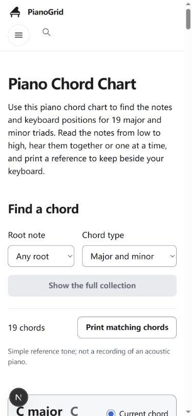
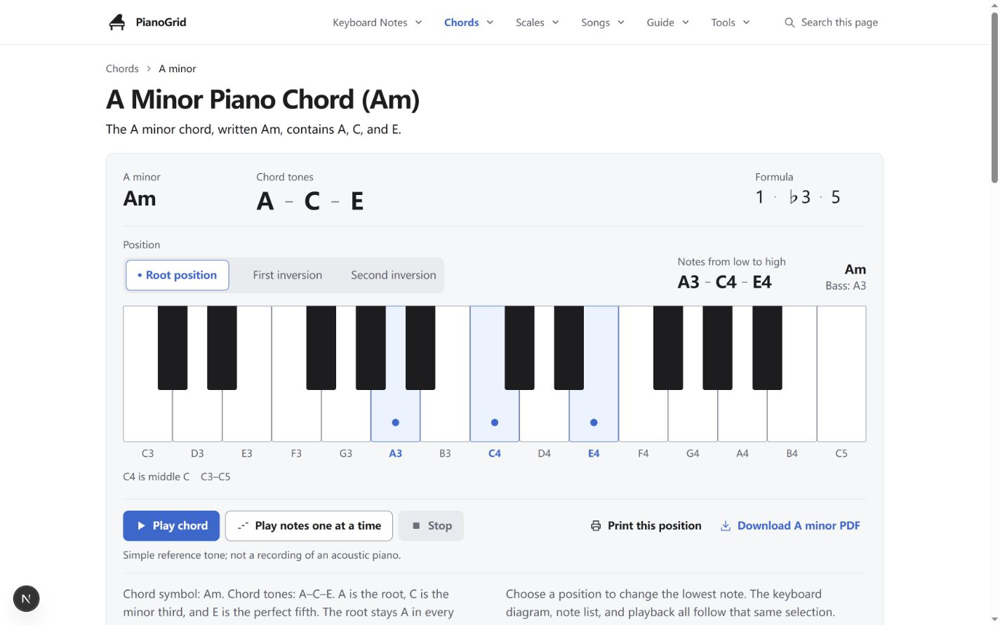

# PianoGrid Chords v2 独立审阅

审阅日期：2026-09-11。对象：`01_PROPOSAL_v2.md` 与当前实际工作区中的 `/chords`、`/chords/a-minor`、`/chords/a-major`、`/chords/c-major`。本报告是 R0 审阅产物，不是实施、提交或部署授权。

## 1. 结论

**READY_WITH_CHANGES：仅针对缩减后的 B1。**

[推断｜建议] 采用“保留主题、全部正确内容、局部调整顺序”的方向，但不采用整套提案原样实施。主要依据：双维筛选、桌面两列卡片、三个详情共享模板、预渲染、音频协调与打印快照已经存在。真正值得先解决的是中心页说明位置过晚、章节导航不直观、Am 的相关链接仍受旧发布状态影响。没有证据支持以本任务为由重新设计主题、重建数据平台或统一所有音区。

- **B1：READY_WITH_CHANGES。** 只做中心＋Am 的轻量章节目录、说明前移、已有内容与链接整理；保持琴键、播放、字号、主题、原锚点和 PDF。
- **B2：缩减为局部适配与回归。** 不再安排“接入三个详情共用模板”或全量 Schema 迁移；只处理具体出现的发布关系、来源展示或新增模块字段。
- **B3：暂缓新增练习与广泛指法。** 现有双维筛选无需再建；学习练习需要独立批准和实现验收。尚无绑定具体音区、手别、排列的完整指法资料，不阻塞 B1。

这不是发布验收通过。人耳试听、实体打印、真实读屏、真机 Safari、PDF 无障碍决定和具名音乐专业审阅不在本轮已通过项目中。

## 2. 优先决定（最多五项）

1. **保留真实浅色蓝色主题。** [已核实] 背景 `#FFFFFF`、工具表面 `#F6F7F9`、正文 `#1D1D1F`、主操作 `#0066CC`，系统字体、无阴影。不要从生成图取色，也不要将黑色琴键误当成深色导航依据。
2. **把中心页的两段查询/比较说明移到结果列表前，加轻量章节锚点目录。** [已核实] 当前 `.ch-chart-notes` 在 19 张卡片之后；390px 时首段说明顶部约为 11,884 CSS px，1440px 时约为 7,092 CSS px（本次测量，非用户行为统计）。[推断] 先告诉用户怎么查和怎么比较，比再次改成“两列卡片”更有实际作用。保留长正文、19 个结果和每项操作。
3. **保留双维筛选和卡片内操作，不新增统一大侧栏。** [已核实] A 根音单选、minor 单选、A＋minor、C♭＋major、无结果均可用；单选当前对象、播放、停止、单项/匹配打印已存在。[推断] 统一工作区会增加“先选中再操作”的成本，目前没有足够证据支持替换。
4. **修正 Am 相关链接的局部发布判断，并补齐 A minor↔A major 的语境内链。** [已核实] `detail-page.tsx` 整体排除了 `am-next`，注释仍说目标全未发布；但 `/chords`、`/chords/a-major`、`/scales/a-minor` 已在 `PUBLIC_ROUTES` 中。原文比较仍在，只是缺少正文链接。建议由适配层读取实际发布白名单；不改只读源 JSON 的历史状态、不改共享 Header。
5. **跳过平台式 Schema 重构；保留 C major 已有指法说明，暂缓扩展。** [已核实] `AMData`、`Voicing`、`Block`、`CenterModel` 和两个服务端适配器已承担提案的大部分职责。C major 有独立 Yamaha 右手原位案例，但没有精确八度或 `voicingId`；不能直接升级成随转位切换的左右手指法系统。

## 3. 版本证据与主题锁定

### 3.1 版本、工作区、工程

| 项目 | 本次直接证据与判断 |
|---|---|
| 分支 / HEAD | [已核实] `main` / `00328ddcc46ab87ed9fb9d1548de6038942b48b1`。审阅的是含现有未提交改动的工作区，不是仅此 commit。 |
| 起始状态 | [已核实] `evidence/workspace-before.json` 保存起始 porcelain 状态及 3,149 个已有文件的 SHA-256。原先已有四页、`experience.tsx`、`detail-page.tsx`、音频、CSS、布局、文档、脚本、审核产物等改动；`docs/pianogrid-chords-v2/` 原先为未跟踪目录，开始时无 `review.md`。 |
| 包管理器 / 实际安装 | [已核实] npm 与 `package-lock.json`；本机 Node `v24.14.1`、npm `11.11.0`。已安装 Next `16.3.4`、React/React DOM `19.2.8`、Tailwind `4.3.3`、TypeScript `5.9.3`，不是仅抄 package.json 声明。 |
| 页面 / 部署 | [已核实] App Router，四个显式 `src/app/chords/**/page.tsx`；正式 origin `https://pianogrid.com`；仓库说明为 Vercel，线上响应亦可取得 Vercel 响应头。没有部署操作。 |
| 本轮预览 | [已核实] `npm run dev -- --hostname 127.0.0.1 --port 3000`，运行当前工作区。截图含 Next 开发指示器，不把它当作线上产品设计。未重建生产构建，不把旧 `.next` 当本次构建证据。 |
| 本地 / 线上一致性 | [已核实] 四页本地与线上 HTTP 均为 200，解析实际 `<main>` 标签所得文本全部一致；四页 canonical 正确，均为 `index, follow`。C major 的线上 body/Header/工具/主按钮/字体 computed style 与本地抽样一致。未核实线上部署对应的 git commit，不宣称部署字节与工作区整体相同。 |
| 历史文档冲突 | [已核实] `design-system.md`、`inspection.md` 中“空项目/尚未安装/未取得规划 Markdown”等是 Foundation 历史状态。当前完整 `docs/product/Piano_全站统一规划_最终版.md` 已存在。采用当前源码、已安装包、发布清单及本次响应，不能让历史文字倒退现站。 |
| 读取范围 | [已核实] 已读 AGENTS、README、设计系统/inspection/tokens、只读 reference 说明及 CSS 来源、URL 规划、完整规划入口、和弦内容包/源 JSON、F 包两页数据/内容/来源/问题条目及 release-readiness。未读取或执行 `03_IMPLEMENT_PROMPT.md`。 |

核心路径：`src/styles/tokens.css` → `foundation.css` → `src/app/globals.css`；`src/app/chords/a-minor/a-minor.css`＋`src/components/chords/shared.css`＋`center.css`；Header/Footer 为 `chords/site-chrome.tsx`，实际导航为 `site-navigation.tsx`/`.css`，品牌为 `ui/site-brand.tsx`/`.css`。键盘为 `a-minor/keyboard.tsx`＋`chords/keyboard-viewport.tsx`；音频为 `lib/a-minor-audio.ts`；打印为 `chords/print-voicing.tsx` 与两个 experience；metadata 为四个页面入口、`lib/site-config.ts`、根 layout。

### 3.2 主题表

以下声明均 [已核实] 来自当前源码。computed 列区分实测与仅代码核对；颜色按声明原值记录，不从截图吸色。

| 对象 | 源文件 / token 或类 | 声明值 | computed / 截图证据 | 结论 |
|---|---|---|---|---|
| 页面背景 | `tokens.css --background`；foundation `body` | `#FFFFFF` | `body rgb(255,255,255)`；四页首屏 | 保留 |
| 工具 / 结果表面 | `--surface`；`.am-tool`、`.ch-result` | `#F6F7F9` | 工具 `rgb(246,247,249)` | 保留 |
| 正文 | `--foreground` | `#1D1D1F` | body `rgb(29,29,31)` | 保留 |
| 次要文字 | `--muted-foreground`；键盘说明/反馈/页脚 | `#5C626B` | 源码核对；本次截图可见，未逐元素采样全部文本 | 保留 |
| 分隔 / 输入边界 | `--border` / `--input` | `#E1E4E8` / `#7A828E` | 工具边框 `rgb(225,228,232)`；次按钮边框 `rgb(122,130,142)` | 区分两者，保留 |
| 主操作 | `.am-button.am-primary`、`--primary` | `#0066CC`，白字 | `rgb(0,102,204)`；本地和线上同值 | 保留 |
| 主按钮 hover | `--primary-hover` | `#0057AE` | 代码核对，未单独模拟 hover 采样 | 保留；不冒称交互视觉全验 |
| 次按钮 / hover | `--secondary` / `--secondary-hover` | 白底 / `#E9EDF3` | 默认白底已采样；hover 仅代码核对 | 保留 |
| Focus | foundation `:focus-visible`；radio 代理 `.am-segment` | 蓝色 2px；offset 4px，radio 3px | 代码核对；本轮未完成全键盘焦点链验收 | 保留 |
| 转位选中 / hover | `input:checked + .am-segment` | 白底、蓝字蓝边；hover `#EAF2FF` | `.am-segment` 白底蓝字蓝边、7px 圆角 | 保留 |
| 当前结果 / 表格行 | `.ch-result[data-current=true]` / shared 按 `data-position` | 输入边框色 / `--selected-hover` | radio＋文字；九次转位检查均恰有一个 `aria-current` 行 | 保留，不能删辅助状态 |
| 控件轨道 / 按下 | `--control-track` / hover / pressed | `#E9EBEF` / `#F2F4F7` / `#DCE8F8` | 声明核对，截图可见轨道 | 不另建状态色 |
| 禁用 / 错误 | `--disabled` / foreground / error | `#E8EAEE` / `#686F79` / `#B42318` | 默认 Stop 与清除禁用可见；错误注入未执行 | 保留 |
| 白键 / 黑键 | `--piano-key-white` / black | `#FFFFFF` / `#1D1D1F` | 黑键 computed `rgb(29,29,31)` | 保留 |
| 选中白键 / 圆点 | `--piano-note-selected` / mark | `#EAF2FF` / `#0066CC` | 白键浅蓝底蓝边；截图含圆点与音名 | 保留，不只用颜色表达 |
| 选中黑键 | `shared.css .am-key.am-black.am-is-selected` | 仍黑底；圆点及音名白色 | A major 首屏的 C#5 白字白点 | 不错误地统一为浅蓝键 |
| 发声琴键 | `--piano-note-sounding` / mark | 蓝底、白色标记，另有短线 | 源码核对；点击停止反馈实测，不等于真人听音 | 保留 |
| Header | `.am-site-header`、`site-navigation.css` | 白背景，`--border` 下边线 | 本地 / 线上 `rgb(255,255,255)` | 无深色导航；不动全局导航 |
| Footer | `.am-site-footer`、`.am-footer-inner` | 透明继承白底，分隔线，次要文字 | footer computed 透明，页面底白 | 保留品牌、说明与 Back to top |
| 打印 | `--print-*`＋页面 `@media print` | 白底黑字、黑键 `#111111`、键框 `#555555` | 代码与原 PDF 文本核对；系统打印未执行 | 保留单独打印层 |

[已核实] 字体栈 `system-ui, -apple-system, BlinkMacSystemFont, "Segoe UI", sans-serif`；桌面正文 17px/约27px，手机16px/26px；H1 36/30px、H2 24px（≤352px 部分章节22px）、琴键标签14px、按钮15px。70rem 页面宽、手机16px/桌面32px gutter；正文72ch、工具说明65ch。24px 桌面工具 padding/16px 手机；卡片 gap24px；正文区域当前桌面是 15rem 标题列＋正文列、gap48px，手机已经单列。圆角工具12px、按钮8px、轨道10px、分段7px、键底3px；无阴影。**“单一阅读流”不必强行撤掉当前桌面的章节标题列；它不是新增的固定预览侧栏。**

### 3.3 本轮截图与观测步骤

[已核实] 使用当前 Codex 内置浏览器，同一预览版本，设置 CSS 视口1440×900、390×844；另做320/768检查。下面八张是实际查看过的首屏；开发指示器不计入产品。浏览器截图输出有滚动条与裁边差别，以 recorded CSS viewport 为测试尺寸。

| 步骤 | 页面 | 桌面 / 手机基线 | 健康度与主要发现 |
|---|---|---|---|
| 1 | 中心 | [1440](evidence/chords-1440-top.png) / [390](evidence/chords-390-top.png) | 双筛选清楚，桌面已有两列；说明与后续正文距离远 |
| 2 | Am | [1440](evidence/a-minor-1440-top.png) / [390](evidence/a-minor-390-top.png) | 工具先给答案，手机键盘局部滚动；正文完整，缺相关区 |
| 3 | A major | [1440](evidence/a-major-1440-top.png) / [390](evidence/a-major-390-top.png) | C# 黑键标签存在；保留该页较高原位音区 |
| 4 | C major | [1440](evidence/c-major-1440-top.png) / [390](evidence/c-major-390-top.png) | 共享结构可用；保留独有右手案例及适用范围 |

[已核实] `evidence/chords-1440.png` 的内置浏览器全页拼接出现重复图块、留白异常，**拒绝作为视觉证据**；没有将它当作真实页面重复内容。改用稳定首屏＋实际 DOM 和正文位置测量。未宣称取得合格全页长截图。A minor 最初桌面截图也遇到视口切换未稳定，已用随后稳定截图替换本轮同名新产物；320px 初始键位测量的瞬态 false 亦保留原记录，并另存稳定复测，见第7节。

## 4. 四页完整内容 / 功能映射

### 4.1 映射口径

[已核实] 以下清单以服务端适配后的实际模型 `evidence/models.json`、四页原始响应和 DOM 为准；原 JSON 中9和弦、旧 published=false 等历史值不直接当现状。源文件别名：

- **C**：`src/lib/chord-content.ts::getChordCenter`，底层 `docs/content/site-master/page-content.master.json.pages['/chords']`＋legacy shared＋`/chords/by-key` 已准备数据；显示在 `center-page.tsx`、`center-experience.tsx`。
- **Am**：`src/lib/a-minor-content.ts::getAMinorContent`，底层 `docs/content/chords/page-content.json.pages['/chords/a-minor']`；显示在 `detail-page.tsx`＋`a-minor/experience.tsx`。
- **A/C detail**：`src/lib/chord-content.ts::getChordDetail`，底层 master 各自 `pages[url]`；显示在同一个 `detail-page.tsx`。两页原包各有3段核心正文，适配器另外生成参考、表格、打印、related，以及 C 的指法段。

每个表的 p、step、row 从1计数；表格列头也登记；链接逐条登记。H2/H3 由 heading/结果对象条目对应；原位示例小标题与工具摘要单列。**KEEP 表示保留原信息和用途；MOVE 是位置变化；ADD/CORRECT 是建议，尚未执行。** 每条建议都给去向，正确内容无去向计数为0；这不是新版已实现的保留验收。

### 4.2 /chords：逐项正文、表格、FAQ及链接

[已核实] 以下原内容逐项来自当前页面模型及对应原始HTML；每行的KEEP/MOVE/CORRECT属于建议，未实施。

| 原位置 / 内容索引 | 原内容或功能（完整条目） | 动作 | 建议新位置 / 原因 |
|---|---|---|---|
| 页面metadata | Title: Piano Chord Chart: Notes, Keyboard Diagrams & PDF；Description: Explore major and minor piano chords with note names, keyboard diagrams, sound examples, and printable references.；canonical: https://pianogrid.com/chords | KEEP | 仍在原页面head；不回退到历史JSON的短标题 |
| chords-intro/heading | Piano Chord Chart | KEEP | 仍在顶部 data-block-id=chords-intro；当前没有该名称的独立id锚点，不虚构旧锚点 |
| chords-intro/p1 | Use this piano chord chart to find the notes and keyboard positions for 19 major and minor triads. Read the notes from low to high, hear them together or one at a time, and print a reference to keep beside your keyboard. | KEEP | 仍在顶部 data-block-id=chords-intro；当前没有该名称的独立id锚点，不虚构旧锚点 |
| chords-intro/p2 | The chart includes the major and minor triads already prepared across six common major keys and D minor, plus selected parallel and enharmonic comparisons. It is a practical foundation, not a complete list of piano chords. | MOVE | 查询标题之后、筛选/结果之前；避免解释在19项列表尾部 |
| chords-chart/heading | Find a chord | KEEP | 查询章节，位于真实结果前；保留锚点 |
| chords-chart/p1 | Choose a root note and chord type to narrow the chart. Each result gives the chord symbol, its three notes, and one root-position example. The first note listed is the lowest note in that example. | MOVE | 查询标题之后、筛选/结果之前；避免解释在19项列表尾部 |
| chords-chart/p2 | For a first comparison, use A major and A minor, or C major and C minor. Keep the root and top note the same and notice which middle note changes. | MOVE | 查询标题之后、筛选/结果之前；避免解释在19项列表尾部 |
| chords-how-to-read/heading | How to read this piano chord chart | KEEP | 仍在 #chords-how-to-read；保留标题/锚点与章节职责 |
| chords-how-to-read/p1 | A dot marks a key to play. The labels identify those pitches; a sharp (♯) raises a written note by one semitone, and a flat (♭) lowers it by one semitone. | KEEP | 仍在 #chords-how-to-read；保留标题/锚点与章节职责 |
| chords-how-to-read/p2 | C4 means middle C. The number after a note is its octave, not a finger number. The diagrams use the same C3–C5 window so you can compare positions. A note such as C♭4 keeps the octave of its written C even though it uses the B3 key. | KEEP | 仍在 #chords-how-to-read；保留标题/锚点与章节职责 |
| chords-how-to-read/step1 | Read the chord name and its note list. A symbol such as Am names the root A and the minor chord type. | KEEP | #chords-how-to-read 原有顺序列表；不替换成概括卡片 |
| chords-how-to-read/step2 | Match the marked keys to the labels. Notes are listed from lowest to highest. | KEEP | #chords-how-to-read 原有顺序列表；不替换成概括卡片 |
| chords-how-to-read/step3 | Use Play chord to hear the notes together, or Play notes one at a time to hear the same notes in ascending order. | KEEP | #chords-how-to-read 原有顺序列表；不替换成概括卡片 |
| chords-how-to-read/step4 | Compare the keyboard image with the printed note list before playing it on your instrument. | KEEP | #chords-how-to-read 原有顺序列表；不替换成概括卡片 |
| chords-major-minor/heading | Major and minor: change the third | KEEP | 仍在 #chords-major-minor；保留标题/锚点与章节职责 |
| chords-major-minor/p1 | A major triad places its third four semitones above the root. A minor triad places its third three semitones above the root. Both use a perfect fifth, seven semitones above the root. | KEEP | 仍在 #chords-major-minor；保留标题/锚点与章节职责 |
| chords-major-minor/p2 | In the A examples, C♯ becomes C while A and E stay in place. In the C examples, E becomes E♭ while C and G stay in place. The note names in the tables are chord members, not finger numbers. | KEEP | 仍在 #chords-major-minor；保留标题/锚点与章节职责 |
| chords-major-minor/table-head | Root / Major triad / Minor triad / What changes | KEEP | #chords-major-minor 表头；保留列语义与可滚动边界 |
| chords-major-minor/row1 | A / A–C♯–E / A–C–E / C♯ lowers to C | KEEP | #chords-major-minor 原完整表格，不只显示当前行 |
| chords-major-minor/row2 | C / C–E–G / C–E♭–G / E lowers to E♭ | KEEP | #chords-major-minor 原完整表格，不只显示当前行 |
| chords-print/heading | Print a piano chord reference | KEEP | 仍在 #chords-print；保留标题/锚点与章节职责 |
| chords-print/p1 | Download the original three-page reference with nine selected chord names. The interactive chart above contains the broader 19-chord collection; use Print this chord or Print matching chords for those results. | KEEP | 仍在 #chords-print；保留标题/锚点与章节职责 |
| chords-print/p2 | To keep a smaller reference, print the current chord or the results matching your filters. Check the chord names in the print preview before printing. | KEEP | 仍在 #chords-print；保留标题/锚点与章节职责 |
| chords-questions/heading | Questions about this chart | KEEP | 仍在 #chords-questions；保留标题/锚点与章节职责 |
| chords-questions/FAQ1 | Are these all the chords on piano? / No. This chart covers 19 major and minor triads. Diminished, seventh, power, and jazz chords are not included in this collection. | KEEP | #chords-questions 原生details，问题与完整答案仍预渲染 |
| chords-questions/FAQ2 | What are the 12 chords for piano? / There are 12 semitone pitch positions in an octave in equal temperament. A root can support more than one chord type, so “12 chords” does not mean there are only 12 chords on a piano. Check which chord type a chart is listing. | KEEP | #chords-questions 原生details，问题与完整答案仍预渲染 |
| chords-questions/FAQ3 | Does the PDF show finger positions? / It shows which keys to play, with note and octave labels. It does not give finger numbers. | KEEP | #chords-questions 原生details，问题与完整答案仍预渲染 |
| chords-questions/FAQ4 | Why do B major and C-flat major use the same keys? / They are enharmonic spellings in this keyboard reference. B major is B–D♯–F♯; C-flat major is C♭–E♭–G♭. Keep the spelling shown by the chord you are reading. | KEEP | #chords-questions 原生details，问题与完整答案仍预渲染 |
| chords-next/heading | Explore A minor in more detail | KEEP | 仍在 #chords-next；保留标题/锚点与章节职责 |
| chords-next/p1 | See the same A-minor chord in root position, first inversion, and second inversion. | KEEP | 仍在 #chords-next；保留标题/锚点与章节职责 |
| chords-next/link1 | A minor piano chord: notes and inversions → /chords/a-minor | KEEP | 仍在 #chords-next；保留标题/锚点与章节职责 |

**19个结果的逐项映射（每条均保留名称/H3、全部音高、低音、键盘、当前项radio、两种播放、Stop及Print this chord）：**

| 原结果 / 身份 | 原位低到高 / 低音 | 已有详情入口 | 动作与新位置 |
|---|---|---|---|
| c-major / C major / C | C4–E4–G4 / C4 | /chords/c-major | KEEP：仍在原顺序结果网格，C3–C5完整键盘窗口 |
| a-minor / A minor / Am | A3–C4–E4 / A3 | /chords/a-minor | KEEP：仍在原顺序结果网格，C3–C5完整键盘窗口 |
| f-major / F major / F | F4–A4–C5 / F4 | 无；不能创建假详情链接 | KEEP：仍在原顺序结果网格，C3–C5完整键盘窗口 |
| d-minor / D minor / Dm | D4–F4–A4 / D4 | 无；不能创建假详情链接 | KEEP：仍在原顺序结果网格，C3–C5完整键盘窗口 |
| g-major / G major / G | G3–B3–D4 / G3 | 无；不能创建假详情链接 | KEEP：仍在原顺序结果网格，C3–C5完整键盘窗口 |
| e-minor / E minor / Em | E4–G4–B4 / E4 | 无；不能创建假详情链接 | KEEP：仍在原顺序结果网格，C3–C5完整键盘窗口 |
| d-major / D major / D | D4–F♯4–A4 / D4 | 无；不能创建假详情链接 | KEEP：仍在原顺序结果网格，C3–C5完整键盘窗口 |
| b-minor / B minor / Bm | B3–D4–F♯4 / B3 | 无；不能创建假详情链接 | KEEP：仍在原顺序结果网格，C3–C5完整键盘窗口 |
| a-major / A major / A | A3–C♯4–E4 / A3 | /chords/a-major | KEEP：仍在原顺序结果网格，C3–C5完整键盘窗口 |
| f-sharp-minor / F-sharp minor / F♯m | F♯3–A3–C♯4 / F♯3 | 无；不能创建假详情链接 | KEEP：仍在原顺序结果网格，C3–C5完整键盘窗口 |
| e-major / E major / E | E3–G♯3–B3 / E3 | 无；不能创建假详情链接 | KEEP：仍在原顺序结果网格，C3–C5完整键盘窗口 |
| c-sharp-minor / C-sharp minor / C♯m | C♯4–E4–G♯4 / C♯4 | 无；不能创建假详情链接 | KEEP：仍在原顺序结果网格，C3–C5完整键盘窗口 |
| b-major / B major / B | B3–D♯4–F♯4 / B3 | 无；不能创建假详情链接 | KEEP：仍在原顺序结果网格，C3–C5完整键盘窗口 |
| g-sharp-minor / G-sharp minor / G♯m | G♯3–B3–D♯4 / G♯3 | 无；不能创建假详情链接 | KEEP：仍在原顺序结果网格，C3–C5完整键盘窗口 |
| b-flat-major / B-flat major / B♭ | B♭3–D4–F4 / B♭3 | 无；不能创建假详情链接 | KEEP：仍在原顺序结果网格，C3–C5完整键盘窗口 |
| g-minor / G minor / Gm | G3–B♭3–D4 / G3 | 无；不能创建假详情链接 | KEEP：仍在原顺序结果网格，C3–C5完整键盘窗口 |
| c-minor / C minor / Cm | C4–E♭4–G4 / C4 | 无；不能创建假详情链接 | KEEP：仍在原顺序结果网格，C3–C5完整键盘窗口 |
| a-flat-major / A-flat major / A♭ | A♭3–C4–E♭4 / Ab3 | 无；不能创建假详情链接 | KEEP：仍在原顺序结果网格，C3–C5完整键盘窗口 |
| c-flat-major / C-flat major / C♭ | C♭4–E♭4–G♭4 / Cb4 | 无；不能创建假详情链接 | KEEP：仍在原顺序结果网格，C3–C5完整键盘窗口 |

**比较图（静态图，不带新的试听按钮）：**

| 原章节 / 图标题 | 音高 | 动作 / 去向 |
|---|---|---|
| chords-major-minor / A major | A3–C♯4–E4 | KEEP：原对比表后；C3–C5、middle C说明、各图完整音名和局部滚动保留 |
| chords-major-minor / A minor | A3–C4–E4 | KEEP：原对比表后；C3–C5、middle C说明、各图完整音名和局部滚动保留 |
| chords-major-minor / C major | C4–E4–G4 | KEEP：原对比表后；C3–C5、middle C说明、各图完整音名和局部滚动保留 |
| chords-major-minor / C minor | C4–E♭4–G4 | KEEP：原对比表后；C3–C5、middle C说明、各图完整音名和局部滚动保留 |

### 4.3 /chords/a-minor：逐项正文、表格、FAQ及链接

[已核实] 以下原内容逐项来自当前页面模型及对应原始HTML；每行的KEEP/MOVE/CORRECT属于建议，未实施。

| 原位置 / 内容索引 | 原内容或功能（完整条目） | 动作 | 建议新位置 / 原因 |
|---|---|---|---|
| 页面metadata | Title: A Minor Piano Chord (Am): Notes, Inversions & PDF；Description: Find the A minor chord on piano: A, C, and E. Compare root position, Am/C, and Am/E with keyboard diagrams, sound examples, and a printable PDF.；canonical: https://pianogrid.com/chords/a-minor | KEEP | 仍在原页面head；不回退到历史JSON的短标题 |
| 工作区摘要 / H1 | A Minor Piano Chord (Am)；名称 A minor；符号 Am；组成音 A–C–E；公式 1·b3·5；范围 C3–C5 | KEEP | 原顶部答案和工作区；原音区不变 |
| am-intro/heading | A Minor Piano Chord (Am) | KEEP | 仍在顶部 data-block-id=am-intro；当前没有该名称的独立id锚点，不虚构旧锚点 |
| am-intro/直接答案 | The A minor chord, written Am, contains A, C, and E. | KEEP | 仍在H1后 |
| root-example-heading/H2 | Root-position example | KEEP | 仍在工作区之后，保持原位说明独立于当前转位 |
| am-intro/原位说明1 | All three are white-key notes. In root position, play A as the lowest note, with C and E above it. | KEEP | 仍在Root-position example；仅沿用现有适配文案，不重写原JSON |
| am-intro/原位说明2 | The root-position example uses A3–C4–E4, with C4 as middle C. Listen to these notes together or individually, then compare the two inversions. | KEEP | 仍在Root-position example；仅沿用现有适配文案，不重写原JSON |
| am-result/heading | A minor notes and keyboard positions | KEEP | 仍在 #am-result；保留标题/锚点与章节职责 |
| am-result/p1 | Chord symbol: Am. Chord tones: A–C–E. A is the root, C is the minor third, and E is the perfect fifth. The root stays A in every inversion. | KEEP | 仍在 #am-result；保留标题/锚点与章节职责 |
| am-result/p2 | Choose a position to change the lowest note. The keyboard diagram, note list, and playback all follow that same selection. | KEEP | 仍在 #am-result；保留标题/锚点与章节职责 |
| am-find-notes/heading | Find A, C, and E on the keyboard | KEEP | 仍在 #am-find-notes；保留标题/锚点与章节职责 |
| am-find-notes/p1 | Start with C4, middle C. A3 is two white-key steps to its left: move past B3 to A3. E4 is two white-key steps to the right of C4: move past D4 to E4. | KEEP | 仍在 #am-find-notes；保留标题/锚点与章节职责 |
| am-find-notes/p2 | The marked keys show pitches, not a hand shape or a required fingering. | KEEP | 仍在 #am-find-notes；保留标题/锚点与章节职责 |
| am-find-notes/step1 | Locate A3, C4, and E4 using the labels. | KEEP | #am-find-notes 原有顺序列表；不替换成概括卡片 |
| am-find-notes/step2 | Play them separately to check their order, then sound the three notes together. | KEEP | #am-find-notes 原有顺序列表；不替换成概括卡片 |
| am-find-notes/step3 | If you use another octave, move all three notes by the same number of octaves to keep this root-position shape. | KEEP | #am-find-notes 原有顺序列表；不替换成概括卡片 |
| am-inversions/heading | A minor inversions | KEEP | 仍在 #am-inversions；保留标题/锚点与章节职责 |
| am-inversions/p1 | An inversion changes which chord tone is lowest. First inversion puts C in the bass; second inversion puts E in the bass. The letters after the slash in Am/C and Am/E identify that bass note. | KEEP | 仍在 #am-inversions；保留标题/锚点与章节职责 |
| am-inversions/p2 | These examples use close position without doubled notes. Other spacings are possible; the lowest note determines the inversion. | KEEP | 仍在 #am-inversions；保留标题/锚点与章节职责 |
| am-inversions/table-head | Position / Symbol / Notes, low to high / Bass | KEEP | #am-inversions 表头；保留列语义与可滚动边界 |
| am-inversions/row1 | Root position / Am / A3–C4–E4 / A3 | KEEP | #am-inversions 原完整表格，不只显示当前行 |
| am-inversions/row2 | First inversion / Am/C / C4–E4–A4 / C4 | KEEP | #am-inversions 原完整表格，不只显示当前行 |
| am-inversions/row3 | Second inversion / Am/E / E4–A4–C5 / E4 | KEEP | #am-inversions 原完整表格，不只显示当前行 |
| am-why-minor/heading | What makes this chord minor? | KEEP | 仍在 #am-why-minor；保留标题/锚点与章节职责 |
| am-why-minor/p1 | From A to C is a minor third: three semitone steps. From C to E is a major third: four semitone steps. Together, the outer notes A and E form a perfect fifth. | KEEP | 仍在 #am-why-minor；保留标题/锚点与章节职责 |
| am-why-minor/p2 | Compare A minor, A–C–E, with A major, A–C♯–E. Only the third changes. A minor uses C natural; A major uses C-sharp. The interval pattern identifies the chord as minor, without needing a mood label. | KEEP | 仍在 #am-why-minor；保留标题/锚点与章节职责 |
| am-practice/heading | Try the three positions | KEEP | 仍在 #am-practice；保留标题/锚点与章节职责 |
| am-practice/p1 | Use this as a note-finding check. Work with one position at a time before moving to the next. | KEEP | 仍在 #am-practice；保留标题/锚点与章节职责 |
| am-practice/step1 | Play A3–C4–E4 and say “A in the bass.” | KEEP | #am-practice 原有顺序列表；不替换成概括卡片 |
| am-practice/step2 | Choose first inversion and play C4–E4–A4. Say “C in the bass.” | KEEP | #am-practice 原有顺序列表；不替换成概括卡片 |
| am-practice/step3 | Choose second inversion and play E4–A4–C5. Say “E in the bass.” | KEEP | #am-practice 原有顺序列表；不替换成概括卡片 |
| am-practice/step4 | Without looking at the chord symbol, name the lowest note and identify the position. Check against the table. | KEEP | #am-practice 原有顺序列表；不替换成概括卡片 |
| am-print/heading | Print the A minor reference | KEEP | 仍在 #am-print；保留标题/锚点与章节职责 |
| am-print/p1 | Download the one-page reference to compare all three positions. It includes the exact pitches and keyboard diagrams shown here, with no finger numbers. | KEEP | 仍在 #am-print；保留标题/锚点与章节职责 |
| am-print/p2 | Use Print this position if you only need the current selection. | KEEP | 仍在 #am-print；保留标题/锚点与章节职责 |
| am-questions/heading | A minor questions | KEEP | 仍在 #am-questions；保留标题/锚点与章节职责 |
| am-questions/FAQ1 | Is Am the same as A minor? / Yes. Am is a common chord symbol for the A minor triad. You may also see A min or A−. | KEEP | #am-questions 原生details，问题与完整答案仍预渲染 |
| am-questions/FAQ2 | Does Am/C become a C chord? / No. It is still A minor, with C as the lowest note. Its chord tones are still A, C, and E. | KEEP | #am-questions 原生details，问题与完整答案仍预渲染 |
| am-questions/FAQ3 | Is Am the same as Am7? / No. Am is A–C–E; Am7 adds G. This page covers the three-note Am chord. | KEEP | #am-questions 原生details，问题与完整答案仍预渲染 |
| am-questions/FAQ4 | Are the numbers in A3, C4, and E4 finger numbers? / No. They identify octaves. The diagrams in this reference do not prescribe fingering. | KEEP | #am-questions 原生details，问题与完整答案仍预渲染 |
| am-next/heading | Compare with other chords | CORRECT | 恢复原相关区；目标按实际PUBLIC_ROUTES判断，保留原JSON历史值 |
| am-next/link1 | Piano chord chart: compare major and minor → /chords | CORRECT | 恢复原相关区；目标按实际PUBLIC_ROUTES判断，保留原JSON历史值 |
| am-next/link2 | A major piano chord → /chords/a-major | CORRECT | 恢复原相关区；目标按实际PUBLIC_ROUTES判断，保留原JSON历史值 |
| am-next/link3 | A minor scale: notes and forms → /scales/a-minor | CORRECT | 恢复原相关区；目标按实际PUBLIC_ROUTES判断，保留原JSON历史值 |

**三个排列的图示/声音/打印共同数据（全部保留，不归一到另一页音区）：**

| 原排列ID | 标签 / 符号 / 低音 | 原始音高 / MIDI | 动作 / 去向 |
|---|---|---|
| a-minor--root | Root position / Am / A3 | A3–C4–E4 / 57,60,64 | KEEP：原工作区选择、完整转位表、当前打印；PDF原字节不变 |
| a-minor--first | First inversion / Am/C / C4 | C4–E4–A4 / 60,64,69 | KEEP：原工作区选择、完整转位表、当前打印；PDF原字节不变 |
| a-minor--second | Second inversion / Am/E / E4 | E4–A4–C5 / 64,69,72 | KEEP：原工作区选择、完整转位表、当前打印；PDF原字节不变 |

### 4.4 /chords/a-major：逐项正文、表格、FAQ及链接

[已核实] 以下原内容逐项来自当前页面模型及对应原始HTML；每行的KEEP/MOVE/CORRECT属于建议，未实施。

| 原位置 / 内容索引 | 原内容或功能（完整条目） | 动作 | 建议新位置 / 原因 |
|---|---|---|---|
| 页面metadata | Title: A Major Piano Chord: Notes, Inversions & Keyboard Diagrams；Description: Find the A major piano chord notes A, C-sharp and E. Compare root position and two inversions with keyboard diagrams, sound examples and a printable reference.；canonical: https://pianogrid.com/chords/a-major | KEEP | 仍在原页面head；不回退到历史JSON的短标题 |
| 工作区摘要 / H1 | A Major Piano Chord；名称 A major；符号 A；组成音 A–C#–E；公式 1·3·5；范围 C4–C6 | KEEP | 原顶部答案和工作区；原音区不变 |
| a-major-intro/heading | A Major Piano Chord | KEEP | 仍在顶部 data-block-id=a-major-intro；当前没有该名称的独立id锚点，不虚构旧锚点 |
| a-major-intro/p1 | A major contains A–C#–E. The intervals from the root are a major third and a perfect fifth. | KEEP | 仍在顶部 data-block-id=a-major-intro；当前没有该名称的独立id锚点，不虚构旧锚点 |
| a-major-result/heading | Notes and keyboard position | KEEP | 仍在 #a-major-result；保留标题/锚点与章节职责 |
| a-major-notice/heading | What to notice | KEEP | 仍在 #a-major-notice；保留标题/锚点与章节职责 |
| a-major-notice/p1 | Compare with A minor: C-sharp replaces C while A and E stay the same. The sharp is the chord’s third, so calling it D-flat would hide the stacked-third spelling. | KEEP | 仍在 #a-major-notice；保留标题/锚点与章节职责 |
| a-major-inversions/heading | Compare three positions | KEEP | 仍在 #a-major-inversions；保留标题/锚点与章节职责 |
| a-major-inversions/p1 | The diagrams keep the chord’s spelling while changing which chord tone is lowest. Read the bass note under each position, then compare the note order. Finger numbers are shown only where the exact example has a source; no hand shape is prescribed for the remaining voicings. | KEEP | 仍在 #a-major-inversions；保留标题/锚点与章节职责 |
| a-major-inversions/table-head | Position / Symbol / Notes, low to high / Bass | KEEP | #a-major-inversions 表头；保留列语义与可滚动边界 |
| a-major-inversions/row1 | Root position / A / A4–C#5–E5 / A4 | KEEP | #a-major-inversions 原完整表格，不只显示当前行 |
| a-major-inversions/row2 | First inversion / A/C# / C#4–E4–A4 / C#4 | KEEP | #a-major-inversions 原完整表格，不只显示当前行 |
| a-major-inversions/row3 | Second inversion / A/E / E4–A4–C#5 / E4 | KEEP | #a-major-inversions 原完整表格，不只显示当前行 |
| a-major-reference/heading | Chord reference | KEEP | 仍在 #a-major-reference；保留标题/锚点与章节职责 |
| a-major-reference/p1 | Common names: A, A major, Amaj. | KEEP | 仍在 #a-major-reference；保留标题/锚点与章节职责 |
| a-major-reference/p2 | Intervals from the root: perfect unison, major third, perfect fifth. | KEEP | 仍在 #a-major-reference；保留标题/锚点与章节职责 |
| a-major-print/heading | Print this chord reference | KEEP | 仍在 #a-major-print；保留标题/锚点与章节职责 |
| a-major-related/heading | Related references | KEEP | 仍在 #a-major-related；保留标题/锚点与章节职责 |
| a-major-related/link1 | Piano chord chart → /chords | KEEP | 仍在 #a-major-related；保留标题/锚点与章节职责 |

**三个排列的图示/声音/打印共同数据（全部保留，不归一到另一页音区）：**

| 原排列ID | 标签 / 符号 / 低音 | 原始音高 / MIDI | 动作 / 去向 |
|---|---|---|
| a-major--root | Root position / A / A4 | A4–C#5–E5 / 69,73,76 | KEEP：原工作区选择、完整转位表、当前打印；PDF原字节不变 |
| a-major--first | First inversion / A/C# / C#4 | C#4–E4–A4 / 61,64,69 | KEEP：原工作区选择、完整转位表、当前打印；PDF原字节不变 |
| a-major--second | Second inversion / A/E / E4 | E4–A4–C#5 / 64,69,73 | KEEP：原工作区选择、完整转位表、当前打印；PDF原字节不变 |

[已核实] 本页当前没有独立FAQ或文字练习章节；提案中的“原FAQ/原文字练习”不能被理解成此页原先就有。已有Compare three positions指导文字和表格仍全部保留。

### 4.5 /chords/c-major：逐项正文、表格、FAQ及链接

[已核实] 以下原内容逐项来自当前页面模型及对应原始HTML；每行的KEEP/MOVE/CORRECT属于建议，未实施。

| 原位置 / 内容索引 | 原内容或功能（完整条目） | 动作 | 建议新位置 / 原因 |
|---|---|---|---|
| 页面metadata | Title: C Major Piano Chord: Notes, Inversions & Keyboard Diagrams；Description: Find the C major piano chord notes C, E and G. Compare root position and two inversions with keyboard diagrams, sound examples and a printable reference.；canonical: https://pianogrid.com/chords/c-major | KEEP | 仍在原页面head；不回退到历史JSON的短标题 |
| 工作区摘要 / H1 | C Major Piano Chord；名称 C major；符号 C；组成音 C–E–G；公式 1·3·5；范围 C4–C6 | KEEP | 原顶部答案和工作区；原音区不变 |
| c-major-intro/heading | C Major Piano Chord | KEEP | 仍在顶部 data-block-id=c-major-intro；当前没有该名称的独立id锚点，不虚构旧锚点 |
| c-major-intro/p1 | C major contains C–E–G. The intervals from the root are a major third and a perfect fifth. | KEEP | 仍在顶部 data-block-id=c-major-intro；当前没有该名称的独立id锚点，不虚构旧锚点 |
| c-major-result/heading | Notes and keyboard position | KEEP | 仍在 #c-major-result；保留标题/锚点与章节职责 |
| c-major-notice/heading | What to notice | KEEP | 仍在 #c-major-notice；保留标题/锚点与章节职责 |
| c-major-notice/p1 | All three chord tones are white keys. Moving C above E and G gives E–G–C; E in the bass makes that first inversion, while C remains the root. | KEEP | 仍在 #c-major-notice；保留标题/锚点与章节职责 |
| c-major-inversions/heading | Compare three positions | KEEP | 仍在 #c-major-inversions；保留标题/锚点与章节职责 |
| c-major-inversions/p1 | The diagrams keep the chord’s spelling while changing which chord tone is lowest. Read the bass note under each position, then compare the note order. Finger numbers are shown only where the exact example has a source; no hand shape is prescribed for the remaining voicings. | KEEP | 仍在 #c-major-inversions；保留标题/锚点与章节职责 |
| c-major-inversions/table-head | Position / Symbol / Notes, low to high / Bass | KEEP | #c-major-inversions 表头；保留列语义与可滚动边界 |
| c-major-inversions/row1 | Root position / C / C4–E4–G4 / C4 | KEEP | #c-major-inversions 原完整表格，不只显示当前行 |
| c-major-inversions/row2 | First inversion / C/E / E4–G4–C5 / E4 | KEEP | #c-major-inversions 原完整表格，不只显示当前行 |
| c-major-inversions/row3 | Second inversion / C/G / G4–C5–E5 / G4 | KEEP | #c-major-inversions 原完整表格，不只显示当前行 |
| c-major-fingering-example/heading | Right-hand root-position example | KEEP | 仍在 #c-major-fingering-example；保留标题/锚点与章节职责 |
| c-major-fingering-example/p1 | RH root position only, usual choice from Yamaha: C–E–G → 1–3–5. | KEEP | 仍在 #c-major-fingering-example；保留标题/锚点与章节职责 |
| c-major-reference/heading | Chord reference | KEEP | 仍在 #c-major-reference；保留标题/锚点与章节职责 |
| c-major-reference/p1 | Common names: C, C major, Cmaj. | KEEP | 仍在 #c-major-reference；保留标题/锚点与章节职责 |
| c-major-reference/p2 | Intervals from the root: perfect unison, major third, perfect fifth. | KEEP | 仍在 #c-major-reference；保留标题/锚点与章节职责 |
| c-major-print/heading | Print this chord reference | KEEP | 仍在 #c-major-print；保留标题/锚点与章节职责 |
| c-major-related/heading | Related references | KEEP | 仍在 #c-major-related；保留标题/锚点与章节职责 |
| c-major-related/link1 | Piano chord chart → /chords | KEEP | 仍在 #c-major-related；保留标题/锚点与章节职责 |

**三个排列的图示/声音/打印共同数据（全部保留，不归一到另一页音区）：**

| 原排列ID | 标签 / 符号 / 低音 | 原始音高 / MIDI | 动作 / 去向 |
|---|---|---|
| c-major--root | Root position / C / C4 | C4–E4–G4 / 60,64,67 | KEEP：原工作区选择、完整转位表、当前打印；PDF原字节不变 |
| c-major--first | First inversion / C/E / E4 | E4–G4–C5 / 64,67,72 | KEEP：原工作区选择、完整转位表、当前打印；PDF原字节不变 |
| c-major--second | Second inversion / C/G / G4 | G4–C5–E5 / 67,72,76 | KEEP：原工作区选择、完整转位表、当前打印；PDF原字节不变 |

[已核实] 本页当前没有独立FAQ或文字练习章节；提案中的“原FAQ/原文字练习”不能被理解成此页原先就有。已有Compare three positions指导文字和表格仍全部保留。

[已核实] 上述自动逐项展开共 **147项**；每项均有动作和明确去向。另有共用控件/隐藏层/资源见下表；不存在用一句“正文保留”代替未盘点内容的条目。

### 4.6 共用交付、隐藏层和资源

| 页面 / 原位置 | 内容或功能 / 证据 | 动作 | 建议新位置与理由 |
|---|---|---|---|
| 四页 Header / Footer | `site-chrome.tsx`：PianoGrid首页链接、导航、页脚说明 `Clear piano references for focused practice.`、`#main` 回顶 | KEEP | 保持原位置和外观 |
| 四页全站导航 | `site-routes.ts::SITE_NAVIGATION`：Keyboard Notes（labeled/chart）、Chords（三详情）、Scales（C major/A minor）、Songs（easy）、Guide（read-sheet-music）、Tools（blank-sheet-music） | KEEP | 桌面菜单、移动导航都保留；所有实际入口以17条白名单为准，不能以移动/桌面重复为由删除 |
| 中心 skip / 详情 skip、breadcrumb | `#chords-chart`、`#am-result`、`#a-major-result`、`#c-major-result`；详情 Chords 链接和当前对象 | KEEP | 保留锚点、跳过导航和面包屑；新增目录不能覆盖旧 ID |
| 四页 Search this page | `page-search.tsx`：dialog、搜索框、匹配章节数、结果锚点、关闭/Escape/焦点返回；打开会停止声音 | KEEP | 仍是本页搜索，不能改称全站搜索；新目录与它共存。中心搜索目前搜章节文本，不是19张卡片名称搜索 |
| 三详情摘要 | `experience.tsx .am-summary`：对象/符号、组成音、公式；当前排列音序、低音、slash 符号 | KEEP | 顶部工作区；无需另堆重复“根音/类型/当前”徽章 |
| 三详情转位控件 | 3个原生radio；`change()`停止旧播放、同步键盘/音序/符号/低音/表格当前行及打印模型 | KEEP | 原工作区。表格本身是静态参考，不是可点击转位按钮；保留所有三行 |
| 中心双筛选 | 原生根音/类型select，AND查询、可独立选择、结果数、Show the full collection | KEEP | 查询区。Any root / Major and minor 已可分别清一维；无需另加一排重复清除按钮 |
| 中心当前对象 | 每张卡片radio及 `Current chord`；筛选保留仍匹配对象，否则选首个结果，空集清空 | KEEP | 卡片内；不能改成点击整张卡片即导航。重置筛选保留有效选中项，不承诺强制回到C |
| 中心无结果 | `No chord in this collection matches both choices. Change the root or chord type.`，打印禁用 | KEEP | 结果位置；不是宣称该和弦不存在，不自动取消用户的两项条件 |
| 各结果音频 | Play chord / Play notes one at a time / Stop；同一个 `ReferenceAudio` 协调，正弦参考音、用户点击才创建音频 | KEEP | 保留每卡和详情工作区原按钮；保留准备中/停止/完成/错误/不可用反馈。未提供音色选择器 |
| 琴键与说明 | `KeyboardViewport`：完整C3–C5或C4–C6范围、middle C、选中标记、音名、上下键平移、方向/Home/End键 | KEEP | 不裁剪底层音区；小屏只做带边界的局部滚动，不做更小字号 |
| 详情无JS | `<noscript>`：原位图、比较表、解释、PDF仍可读；切换/音频需JS | KEEP | 工作区。首屏预渲染控件禁用，hydration后才启用；不能移除 `ready` 或把正文全放进它 |
| 中心无JS | 全19图、解释、原九和弦PDF保留；过滤/音频需要JS | KEEP | 查询区说明；不将静态19结果改成首次点选后才出现 |
| 辅助状态 | `aria-live`、当前行 sr-only `current selection`、转位 announcement、错误区、表格caption、键盘alt | KEEP | 同步原语义位置；视觉点、ARIA状态、播报用途不同，不是重复正文 |
| 详情打印层 | `#print-content`＋`PrintVoicing`：品牌、标题、组成音/公式、排列音符/低音/符号、键盘、说明、URL | KEEP | 仍为独立 print-only 快照。按钮/浏览器 beforeprint停止声音，afterprint清快照 |
| 中心打印层 | `#center-print-content`：当前项或完整匹配集合，一项一打印区；空集说明 | KEEP | 页面底部隐藏打印层，保留19项打印能力，不仅打印可见卡片 |
| 中心打印操作 | 每卡 Print this chord；结果条 Print matching chords；正文打印区PDF/当前/匹配三操作 | KEEP | 各自上下文保留。看似重复但分别是卡片、集合、资源入口，不在B1删除 |
| 三详情打印操作 | 工作区及正文 Print this position / Download PDF | KEEP | 两处均保留；单个当前转位与整份三转位PDF不混淆 |
| 新页内目录 | 目前没有独立常驻章节目录，现有的是本页搜索和锚点 | ADD | 标题之后，真实锚点链接；只列已存在章节，不出现未实现左右手/练习空入口，不加固定底栏 |
| 原 SVG 素材 | master assets / legacy diagram refs 中仍有原位、三转位SVG；当前网页是预渲染HTML/CSS键盘图，非直接嵌入所有原SVG | KEEP | 原素材保留在资料包，当前未公开的SVG不突然变成下载承诺；不以更换渲染方式为任务 |

| 实际原文件 | 已核实范围 / 文本 | 动作 / 去向 |
|---|---|---|
| `/reference/preserved-chords/assets/piano-chord-chart-selected.pdf` | 3页；C、Am、A、Cm、G、E、A♭、B、C♭九个命名三和弦原位；middle C、八度非指号、C♭保留拼写及B3对应说明；不含指法 | KEEP；中心原打印区及下载入口，仍明确original 9-chord |
| `/assets/chords/a-minor-notes-inversions.pdf` | 1页；Am三转位、C3–C5图、公式、低音、八度非指号及非指定手形说明；文件仍写Piano Reference | KEEP；Am两个原入口。历史PDF品牌不触发本轮重制 |
| `/reference/assets/chord-a-major.pdf` | 1页；A4–C#5–E5、C#4–E4–A4、E4–A4–C#5；三转位，无规定指法，来源/日期说明 | KEEP；A major两个原入口 |
| `/reference/assets/chord-c-major.pdf` | 1页；C4–E4–G4、E4–G4–C5、G4–C5–E5；三转位，指法另看网页说明，来源/日期 | KEEP；C major两个原入口；不声称PDF含网页的1–3–5案例 |

[已核实] PDF页数与文本来自本轮 `evidence/pdf-content.json`，不是复用历史“visual_qa passed”。本轮未重制或覆盖文件，也未完成其图像逐页视觉验收。资源可读性与无障碍、版面质量是不同验收项。

## 5. 提案逐项独立判定

| 提案项 | 主结论 | 证据与唯一主建议 |
|---|---|---|
| 两种母版、三个详情共享 | **采用现有实现** | [已核实] 中心 `ChordCenterPage` 与三页 `ChordDetailPage` 已存在。保留页面专属数据，不再建另一套同义模板。 |
| 根音×类型模型 | **采用现有实现** | [已核实] 19个对象、13种根音拼写、major/minor；原生select与AND过滤实际可用。不是12个调，也不是12种完整根音音高覆盖。 |
| 全12按钮、等音合并 | **不采用** | [已核实] 现有集合同时包含B、C♭，没有D♭；C♯来自minor对象。强制12按钮会丢拼写/暗示全覆盖。维持精确拼写筛选。 |
| 筛选后生成新URL | **不采用** | [已核实] 当前过滤不改路径；4条显式路由已满足当前职责。无须动态页或generateStaticParams迁移。 |
| 桌面两列 / 手机一列 | **采用现状，调整任务表述** | [已核实] `center.css @media(min-width:67rem)`已是两列，其余一列。不要把已完成的布局再次包装成改造。 |
| 全文改成单列 | **调整** | [推断] 保留现有桌面章节标题列＋72ch正文及移动单列，先验证导航和说明前移；截图没有证明需要撤掉全部标题列。 |
| 更大留白 | **调整** | [已核实] 已有24px卡片gap、40/32px章节padding。中心当前主要问题是纵向距离；不机械增加到64px或缩字号。 |
| 不加大侧栏预览 | **采用** | [推断] 原卡片是直接操作单元；统一预览会改变选择/播放/打印路径，未有用户证据证明值得承担成本。 |
| 页内目录 | **采用增量** | [已核实] 只有搜索弹窗、skip和锚点。用轻量真实链接直达原章节，不做内容卸载Tabs，不删本页搜索。 |
| 中心读图/大小对比再写一遍 | **不采用重复新增** | [已核实] 半音、八度、C♭、大小三度、两组对比表与四图已存在；只前移说明/增锚点，不重写百科。 |
| Am/C、C natural与C#、八度说明 | **采用原内容** | [已核实] `am-inversions`、`am-why-minor`、FAQ已有明确解释。无需重复新增。 |
| A major C#拼写说明 | **采用原内容** | [已核实] `a-major-notice` 已解释为何不用D♭；补比较链接即可。 |
| C chord与C major scale区分 | **暂缓新增正文** | [已核实] 当前该段未有。可在已批准内容批次增一句语境说明并连 `/scales/c-major`；不阻塞B1，也不当作音乐数据错误。 |
| 详情“根音/类型”标识 | **调整** | [已核实] 顶部已经有对象名称、符号、组成音、公式。保留现有可读身份；若补说明，应解释概念，不叠加装饰徽章。 |
| A major / Am 同音区比较 | **调整** | [已核实] 中心A major为A3–C♯4–E4，与Am同区；A major详情原位为A4–C#5–E5。用中心原有同区比较，不移调原详情/PDF，不把合法音区差异误判成数据错误。 |
| 详情增加手别切换 | **暂缓** | [已核实] A、C原voicing的左右手指法字段均null；Am当前模型无手别案例。没有完整来源映射，不能做假selector。 |
| C major右手原位案例 | **采用并保留边界** | [已核实] 当前已有 `RH root position only, usual choice from Yamaha: C–E–G → 1–3–5.`；来源台账E-CHORD及Yamaha正文支持通常的1/3/5。原记录没有八度和voicing引用，保持独立文字案例，不能自动绑定所有转位。 |
| 新增一个反馈练习 | **暂缓至单独B3** | [推断] 先做Am组成音选择题最小；但当前键盘是 `role=img` 的静态图，无逐键可答题能力。需要独立输入/反馈/无JS答案/键盘可访问性，远非画个Check按钮。不能按现成能力写进B1。 |
| JSON Schema / TypeScript / JSON-LD | **调整为局部契约** | [已核实] 类型＋服务端适配器＋检查脚本存在；未发现四页实际JSON-LD脚本。`schema_version`字段不等于可执行JSON Schema。无需为名字迁移所有数据，保持零新依赖。 |
| 新增七套实体模型 | **不采用** | [推断] 提案的职责区分有价值，但现阶段来源/页面/音乐/资源已经分工。只有新增真实模块才增加所需可选字段；保留来源和审核状态在服务端，不能传全站master给客户端。 |
| 图、声、打印统一 | **采用并区别等值记号** | [已核实] 28个显示排列的音高/低音/声频数据核对一致；6个中心项屏幕♯/♭与打印#/b字符串不同，但字母、升降、八度相同。可局部统一显示格式，不能当作换音或全量重构理由。 |
| 必须SSR / 新模板避免空壳 | **采用结果约束，不重做渲染** | [已核实] 实际响应已有正文、键盘、表格、FAQ、下载链接；Client组件仅增强。现有图是HTML/CSS，不要求替换成SVG才能叫静态图。 |
| SEO / canonical / TDH | **保留** | [已核实] 实际metadata取适配器覆盖后的值；A/C标题不同于master旧短标题。不得按源JSON的旧标题回退。四页没有现成JSON-LD，不能说“保留原有效声明”意味着已有一套必须重建的schema.org。 |
| 导航及知识地图 | **调整为语境内链** | [已核实] Header已含四页，Am原related未渲染。修局部关系即可；不公开 `/guide/piano-chords`、`/chords/by-key`、`/chords/finder`、`/chord-progressions`、`/keyboard-notes/finger-numbers`。 |
| 来源与核查范围章节 | **调整** | [已核实] 来源主要在内部台账，页面无单独来源区。先复用可公开原始来源链接，尤其C指法说明；不得虚构具名审核人。完整来源章节不设为B1前置门槛。 |

来源复核：[Yamaha 原文](https://hub.yamaha.com/keyboards/k-how-to/basic-piano-chords-for-beginners-part-1/) 的“The Four Main Three-Note Chord Types”段支持通常拇指/中指/小指组合；[Open Music Theory: Triads](https://viva.pressbooks.pub/openmusictheory/chapter/triads/) 支持根音、性质、拼写与间距区分。[已核实] 本轮读到这些正文；[推断] 资料支持范围有限，不可由此宣称所有手别、音区与转位案例均核对完成。不转载其图或音频。

## 6. 建议的新顺序、交互和分批范围

### 6.1 最小最终顺序

**中心 B1**：原 Header → 原H1和第一段简介 → 新轻量目录（查询/读图/大小对比/打印/FAQ/Am详情）→ `Find a chord` → 原第二段集合边界＋原两段查询与比较说明 → 原根音/类型/清除 → 原结果数、匹配打印、音色说明及反馈 → 原19项卡片 → 原读图两段和四步 → 原大小对比两段、表头两行和四幅图 → 原打印区及PDF范围 → 原四条FAQ → 原Am详情入口 → 原Footer。

**Am B1**：原Header → 原面包屑/H1/直接答案 → 新轻量目录 → 原工作区（包括两段工具说明）→ 原Root-position example两段 → 原找键两段及三步 → 原转位两段及三行表 → 原小和弦原理两段（在A major比较旁加真实详情链接）→ 原文字练习一段四步 → 原打印两段及双操作 → 原四条FAQ → 恢复原下一步链接（用实际发布判断）→ 原Footer。无待核对手别、无空练习占位。

**A major B2**：原Header/面包屑/H1/答案 → 同款轻量目录（若B1验收后决定复用）→ 原工作区 → 原What to notice（补Am语境链接）→ 原Compare three positions全文及三行表 → 原Chord reference两段 → 原打印区 → 原Related references → Footer。不得凭Am存在FAQ、文字练习而声称A major原先也有。

**C major B2**：原Header/面包屑/H1/答案 → 轻量目录（同上条件）→ 原工作区 → 原What to notice → 原Compare three positions全文及三行表 → 原Right-hand root-position example（保持独立适用范围）→ 原Chord reference两段 → 原打印区 → 原Related references → Footer。未审阅的新正文、FAQ或练习不强行填齐九章。

### 6.2 交互行为锁定

[已核实] 现有筛选/选择行为见 `evidence/interactions.json`：A→Am/A major；全部根音＋minor→9项；A＋minor→Am；C♭＋major→C-flat major；C♭＋minor→空集且保留选择。不导航、不自动播放。建议继续使用这套行为，而不是新增严格先根音后类型的向导。

[已核实] 三页九种转位实测同步音序、低音、符号、打印模型与唯一当前表格行。保留页URL身份、旧播放停止、键盘可滚动范围；谱表、手别、指法label mode、八度选择器均不是当前和弦页已有控件。原数据的 `descending_midi` 不等于已交付倒序播放按钮，B1不新增。

[推断｜B3规格建议] 如以后批准练习，只做“选择Am组成音”一种题型，使用规范化pitch class集合判缺音/多音；明确不判断实际演奏、指法或最低音。指定转位/八度另属后续题型。练习状态与查阅radio分开；静态题目、答案在初始HTML；无JS隐藏或禁用答题按钮并说明。先提供可访问的音名选择控件，若做可点击琴键需复用几何但单独实现输入语义，不能把现有静态图的role直接改坏。

### 6.3 文件范围、优先级与停点

| 批次 | 影响 / 难度 / 验证速度 | 实际候选文件与共享影响 | 验证与停点 |
|---|---|---|---|
| B1：中心＋Am顺序样板 | 高于重命名Schema；低到中；容易通过原文和同视口比较验证 | `center-page.tsx`、`center-experience.tsx`、`center.css`；`detail-page.tsx` 的Am条件分支、`a-minor-content.ts` 的发布关系适配。必要时新增一个仅和弦使用的轻量目录组件；不改 `tokens.css`、全站导航。共用detail改动需立即回归A/C，即使B1视觉样板只交Am | 本报告映射逐项、四页原始HTML/原锚点/metadata、1440/390前后图、320/768局部溢出、筛选/播放/打印/无JS回归。样板确认处停；不部署 |
| B2：局部适配与A/C复用 | 中；低到中；目标字段可快速验证 | `chord-content.ts`、`detail-page.tsx`、必要的 `a-minor-types.ts`、和弦本地样式及既有检查脚本。只对新增关系/来源/可选区块增加校验；三页模板已共用，跳过重建 | 验证每页专属正文、C指法边界、三个音区、PDF原字节、三转位一致性。修正检查脚本中的旧metadata预期、旧空集例子/旧音频延迟假设应另有证据，不放宽白名单；四页完成后停 |
| B3：一个练习，资料就绪才加教学案例 | 新能力；中到高；需新增交互与人工核验 | 仅批准后新增 `src/components/chords/` 下的独立练习组件及局部模型字段；沿用现有几何/音频。具体新文件名是候选，当前不存在。审核材料放本任务文档，不修改原只读内容包 | 真反馈、重试/看答案、键盘操作、无JS、错误状态、音符一致性。指法缺材料只暂停对应案例，不阻塞练习或已完成B1；不自动发布 |

[推断] 不需要新增/升级依赖，不需要新Schema包、全局样式体系、共享Header改造或根音路由。若实施者认为必须新增这些，已超出本报告的最小建议，应先给具体问题与方案，而非默认为B2内容。

## 7. 验证结果、证据与具体限制

| 验证 | 本轮实际结果 | 证据 / 限制 |
|---|---|---|
| 版本和文件基线 | 已记录 | `workspace-before.json`；末次差异见第8节 |
| 类型检查 | [已核实] `node node_modules/typescript/bin/tsc --noEmit --incremental false` exit 0 | 禁止emit和增量文件；不是build或浏览器总验收 |
| 本地与线上HTML | [已核实] 8个响应均200；四页main文本相同；标题/描述/实际标签已解析 | `http.json`、`local-*.html`、`live-*.html`、`html-analysis.json` |
| 预渲染内容 | [已核实] 中心19卡片＋4对比图＝23个figure、4FAQ；Am原位图＋3行转位表＋4FAQ；A/C各原位图＋3行表；A/C无FAQ | 来自实际HTML标签，不以RSC脚本内的字符串计数。没有发现必须重做SSR的问题 |
| JSON-LD | [已核实] 四页当前响应均0个 `application/ld+json` | 不是JSON Schema失败；没有证据要求B1新增结构化数据 |
| 禁用JS | [已核实] 原始HTML包含正文/无JS说明/禁用控件/原PDF；源码ready边界已核对 | **未做浏览器级关闭JS的完整操作流程**；不能把HTML解析称作完整noJS体验通过 |
| 浏览器筛选 | [已核实] 独立/组合/空结果/全量恢复均已操作 | `interactions.json`。第一次getByLabel未定位成功，改用新DOM确认的combobox后完成；不是产品无控件 |
| 三详情转位 | [已核实] 九个状态音序/低音/符号/当前行/打印模型正确同步 | `interactions.json`；未操作系统打印对话框 |
| 窄屏 | [已核实] 中心320/390/768/1440测量无页面级横溢出；三详情320/768测量无页面级横溢出 | `layout-center.json`、`responsive-details.json`；Am/Amajor初次切视口的root可见性为false，随后稳定复测为可见，分别见 `a-minor-320-stable.json`、`a-major-320-stable.json`。这说明要等重排稳定，不支持报告永久截键bug |
| 图声打印模型 | [已核实] 28个排列，168项检查：162通过、6项严格字符串相等失败 | `model-validation.json` 保留失败；均为屏幕Unicode升降号/打印ASCII升降号差别。另做28项保留字母、升降、八度的归一化检查全通过，音高/低音/频率/高亮未发现不一致。不是声波实录验证 |
| 搜索 / 停止 | [已核实] Am搜inversions得到章节结果，关闭恢复；逐音后Stop显示Playback stopped | `interactions.json`；不是完整四页键盘/读屏/听音矩阵 |
| 打印机制 | [已核实] 两个experience使用beforeprint/afterprint、flushSync与独立快照；详情打印DOM随转位更新 | 主要为代码核对；**未实测打印期间再改筛选、系统预览、实体输出和打印错误注入** |
| PDF | [已核实] 四份本地原文件可解析，页数3/1/1/1，音符/范围已读 | `pdf-content.json`；未做完整PDF图像逐页验收、标签结构和读屏验收 |
| 主题 | [已核实] 本地computed＋线上C major抽样一致；八张首屏已查看 | `theme-computed.json`、`live-theme.json`、首屏PNG；hover/focus全状态未实测，全页拼接被拒绝 |
| 新练习 / 指法 | 未实现；广泛手别资料不足 | 不得将null改reviewed。C现有案例仅限独立文字说明 |

未运行 `npm run check:foundation`、`npm run check`、`check-integration-data.mjs`：脚本会写固定位置的既有检查报告（本来已有用户改动），本轮不覆盖。未运行完整integration browser、chord browser、fallbacks、build与production检查：本轮是四页方案审阅；已读其副作用与部分断言，不能用历史成功或不适用旧断言代替本轮结果。特别是旧chord脚本对A/C title仍比较master旧值，fallback脚本要求resume前0个oscillator，而当前音频为Safari用户激活同步调度节点；这些差异要按实际契约解释，不能为了“绿灯”重置用户修复。

[已核实] 数据语义核对出现6项字形差异后，没有修改业务数据，也没有删除失败。第一次Python HTML分析缺少bs4，改用标准库HTMLParser完成，未安装依赖；首次读取数据的终端GBK显示失败后用UTF-8输出读取成功。这些是审阅工具限制，不是页面错误。

尚缺材料及阻塞范围：完整左右手/各转位/各音区指法证据只阻塞该教学增量；可点击琴键练习及反馈尚待开发，只阻塞B3；生产build、本轮完整noJS浏览器、真实读屏、真机、系统打印、真人听音和PDF无障碍不因本报告解除。主题基线已可锁定，本次未发现需要用户另选配色的冲突。

## 8. 待批准事项与终止边界

本轮已交付审阅并停止。后续如实施，需用户明确批准**本报告缩减后的B1**，而不是默认批准提案全部内容。

- **主题例外：无。** 不建议改色、字体、品牌或全站主题。
- **删除正确内容：无。** 没有PROPOSE_REMOVE业务内容条目；无JS、打印、辅助状态及移动导航均保留。
- **纠错候选：仅局部发布状态说明/判断。** `am-next` 的“全部未发布”已不符合当前白名单；建议恢复已有三条链接并建立Am↔A major语境内链。原只读资料的历史状态不覆盖。
- **新依赖 / 共享导航：无需求。** 不升级、不加包、不改Header菜单。共享详情模板的四页回归属于必要本地验证。
- **新增练习/指法：另行批准B3。** 当前不加假按钮、不推断新音区或指法、不扩大路由。

### 最终工作区核对

[已核实] 开始与结束对比使用已有文件逐字节SHA-256，而非只看git dirty与否。业务源码、原内容包、只读参考、package/锁文件、用户已有改动均保持起始字节。新文件仅位于 `docs/pianogrid-chords-v2/review.md` 与 `evidence/`。

[已核实] 启动Next开发预览自动把受跟踪的 `next-env.d.ts` 两个类型导入改为 `.next/dev/types`。终检发现后，先核对HEAD候选字节与起始SHA完全相同，再仅恢复这个本轮生成变动；没有回退任何用户改动。见 `evidence/preview-generated-file-restoration.json`。原始终检记录 `workspace-after.json` 保留这次发现；恢复后的最终结果另存 `workspace-final.json`。

[已核实] 本轮预览已停止；分支/HEAD未改变，没有业务实现、内容删除、主题变更、提交或部署。开发缓存可能更新；不把缓存清理扩大成本轮删除操作。最终报告本身不包含任何自动继续执行B1的动作。
